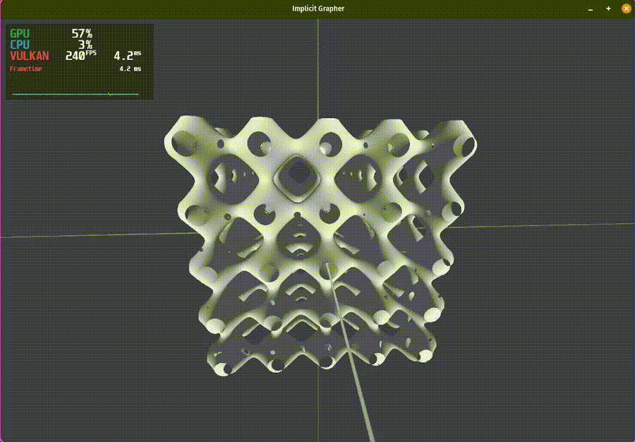
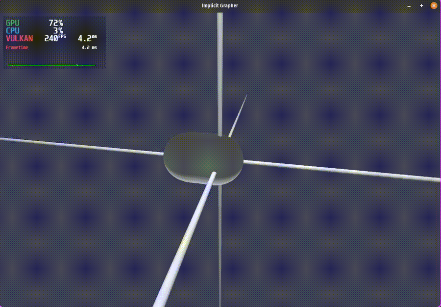
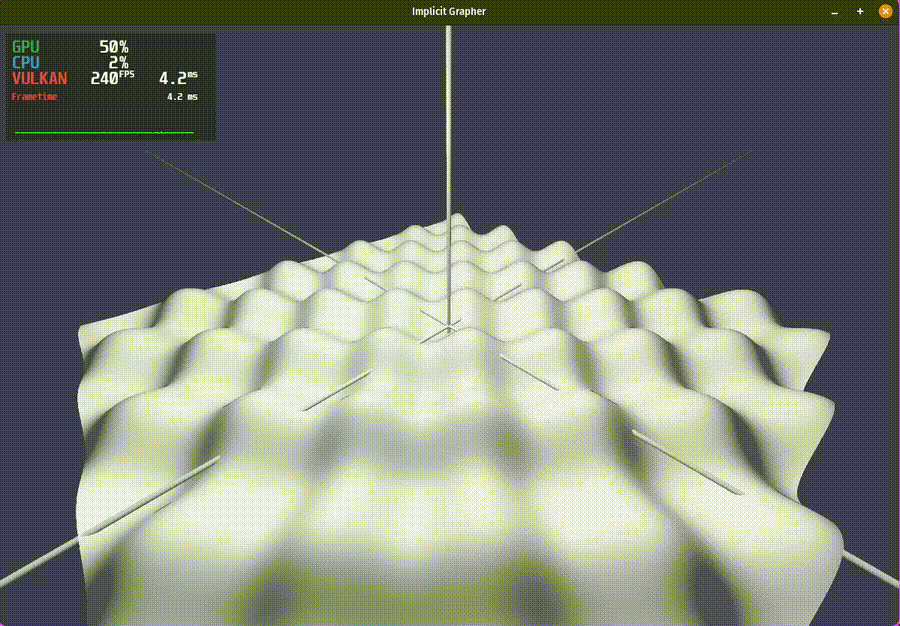

# Implicit Grapher WGPU

> version 1.0

A real-time 3D implicit surface grapher written in Rust using `wgpu` + `wgsl`.

The goal of this project is to render surfaces defined by implicit equations  
of the form

```math
f(x, y, z, t) = 0
```

Such as

```math
cos(x) + cos(y) + cos(z) - sin(t) = 0
```

<div style="display: flex; gap: 100px; align-items: flex-start;">

  <div>
    
  </div>

</div>

(I use RTX 4070 Ti Super with a core i7 14th generation)

in real time using GPU raymarching and more specifically sphere marching. This project is my second large learning project journey into GPU programming. In contrast to my [Reaction Diffusion](https://github.com/ArminGEtemad/reaction_diffusion_wgpu) project, here I put more focus on fragment shader and the following features:

## Features

- Sphere marching (uses Hart's distance estimation so non-Lipschitz surfaces are rendered clean.)
- Basic Transpiler (A built-in terminal interface that lets you type equations and hit `Enter` to see them rendered instantly.)
- Adaptive oversampling for Anti-aliasing (a complete edge detection to make sure that the over sampling only happens at the edge of the shapes.)
- A fully functional camera system to navigate and explore the mathematical creations in 3D space.

Fully implemented in Rust + WGPU + WGSL

Just like my other project everything I try to explain everything I in [the docs here](docs).

## How to run?

You need to clone the project and use cargo to run it.

> git clone https://github.com/ArminGEtemad/implicit_grapher_wgpu.git
>
> cd implicit_grapher_wgpu/grapher3d
>
> cargo run --release

## Interactivity

### Implicit Equation Input

The user can type the implicit equation in the terminal and press enter. The program grapher plots the equation in realtime and there is no need to rerun the program. Right now the prgram handles the operations:

| Supported Operations | what it is     |
| -------------------- | -------------- |
| +                    | Addition       |
| -                    | Subtraction    |
| \*                   | Multiplication |
| /                    | Division       |
| ^                    | Exponentiation |

and the functions

| Supported functions | what it is     |
| ------------------- | -------------- |
| sin()               | Sine           |
| cos()               | Cosine         |
| abs()               | Absolute value |
| sqrt()              | Square Root    |

### Camera & Plot Limits

| Key                            | What it does                                                         |
| ------------------------------ | -------------------------------------------------------------------- |
| W                              | Rotate camera upwards vertically                                     |
| A                              | Rotate camera to left horizontally                                   |
| S                              | Rotate camera downwards vertically                                   |
| D                              | Rotate camera to right horizontally                                  |
| x + Arrow Right/Arrow Left     | Slide camera along positive/negative x axis                          |
| y + Arrow Right/Arrow Left     | Slide camera along positive/negative y axis                          |
| z + Arrow Right/Arrow Left     | Slide camera along positive/negative z axis                          |
| x + Arrow Up/Arrow Down        | Increasing/Decreasing the minimum of the plot limit along the x axis |
| y + Arrow Up/Arrow Down        | Increasing/Decreasing the minimum of the plot limit along the y axis |
| z + Arrow Up/Arrow Down        | Increasing/Decreasing the minimum of the plot limit along the z axis |
| Ctrl + x + Arrow Up/Arrow Down | Increasing/Decreasing the maximum of the plot limit along the x axis |
| Ctrl + y + Arrow Up/Arrow Down | Increasing/Decreasing the maximum of the plot limit along the y axis |
| Ctrl + z + Arrow Up/Arrow Down | Increasing/Decreasing the maximum of the plot limit along the z axis |
| Shift (hold)                   | Doubles the speed of camera movement and change in plot limits       |
| Mouse wheel                    | Camera zoom in and out                                               |
| O                              | Camera points towards the origin of the coordinates                  |

## More GIFs

```math
(\frac{2.5 }{x^2 + y^2 + z^2 + 0.1} ) + (\frac{2.5}{(x - 2\cdot sin(t))^2 + y^2 + z^2 + 0.1} ) - 2.0
```

<div style="display: flex; gap: 100px; align-items: flex-start;">

  <div>
    
  </div>

</div>

```math
y - sin(x + t) * cos(z + t)
```

<div style="display: flex; gap: 100px; align-items: flex-start;">

  <div>
    
  </div>

</div>

## Dependencies

- winit 0.30.12
- wgpu 28.0.0
- pollster 0.4.0
- notify 8.2.0
- bytemuck 1.24.0

## License

This project is under [MIT License](LICENSE).
