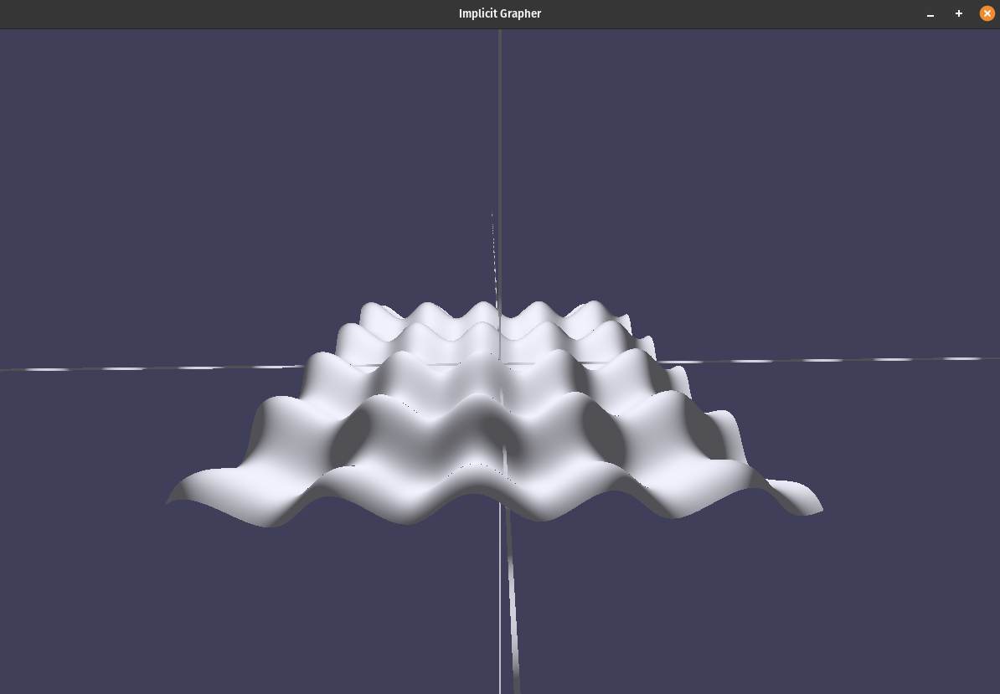
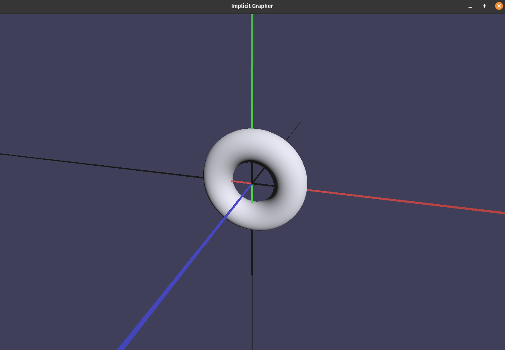
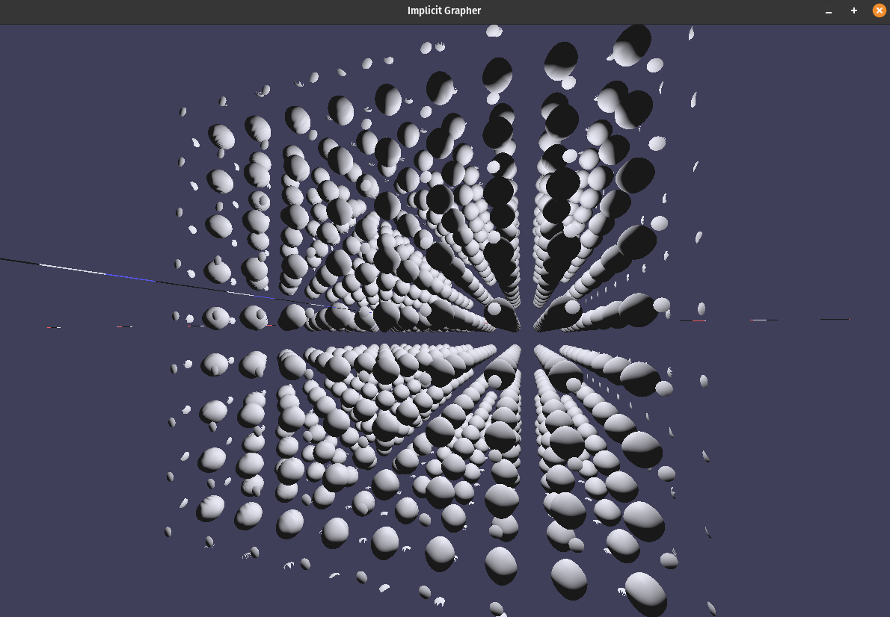
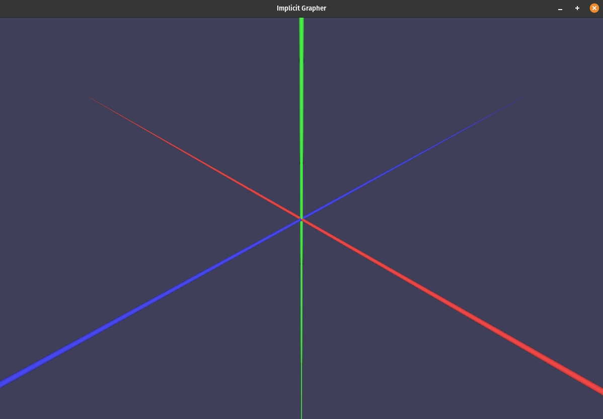
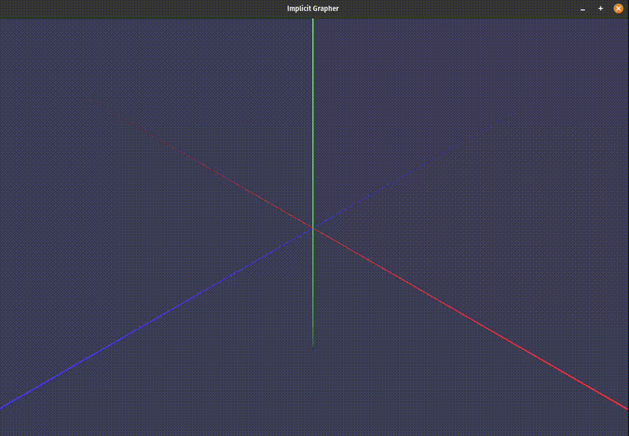
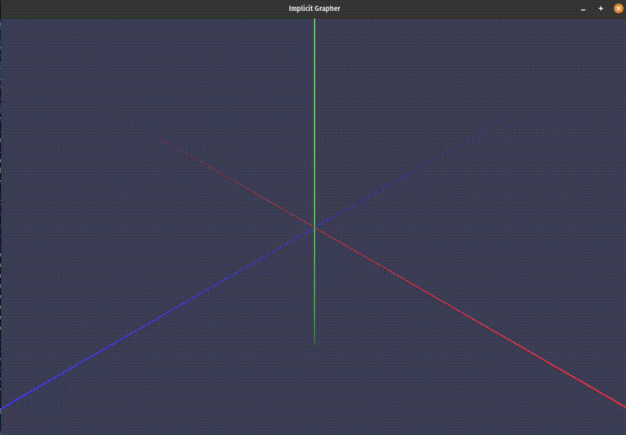
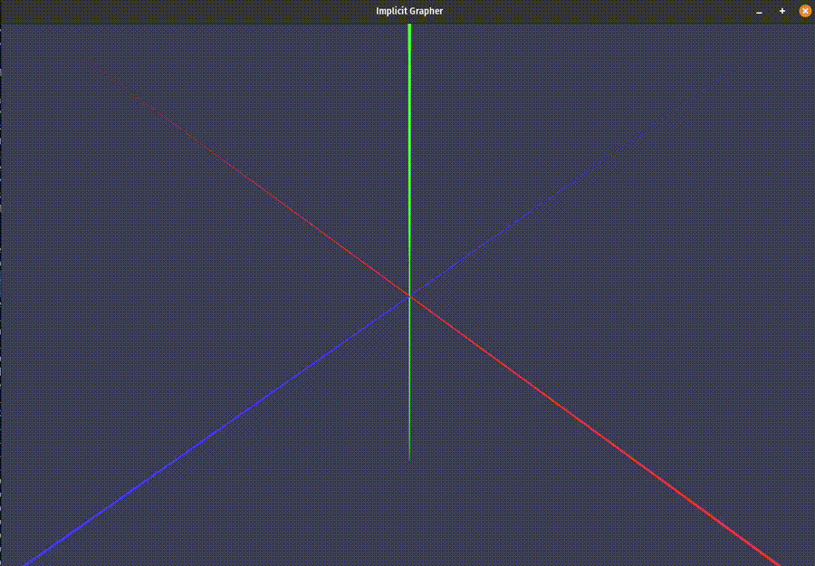

# Implicit Grapher WGPU

A real-time 3D implicit surface grapher written in Rust using `wgpu` + `wgsl`.

The goal of this project is to render surfaces defined by implicit equations  
of the form

```math
f(x, y, z) = 0
```

in real time using GPU raymarching.

This project is my second large learning project journey into GPU programming.

## Milestones

### Third Focus

- [ ] Adding a better camera (Quaternions)
- [ ] Testing other methods of raymarching (step marching)

### Second Focus

- [x] Basic Transpiler
- [x] Handling User Implicit Equation in Realtime
- [x] Handling Shading artifacts and dark spots
- [ ] Adding Antialiasing

### First Focus

- [x] Basic WGPU setup
- [x] Raymarcher prototype
- [x] Camera Setup

## Interactivity

### Implicit Equation Input

The user can type the implicit equation in the terminal and press enter. The program grapher plots the equation in realtime and there is no need to rerun the program. Right now the prgram handles the operations:

| Supported Operations | what it is     |
| -------------------- | -------------- |
| +                    | Addition       |
| -                    | Subtraction    |
| \*                   | Multiplication |
| /                    | Division       |
| ^                    | Exponentiation |

and the functions

| Supported functions | what it is     |
| ------------------- | -------------- |
| sin()               | Sine           |
| cos()               | Cosine         |
| abs()               | Absolute value |
| sqrt()              | Square Root    |

### Camera & Plot Limits

| Key                            | What it does                                                         |
| ------------------------------ | -------------------------------------------------------------------- |
| W                              | Rotate camera upwards vertically                                     |
| A                              | Rotate camera to left horizontally                                   |
| S                              | Rotate camera downwards vertically                                   |
| D                              | Rotate camera to right horizontally                                  |
| x + Arrow Right/Arrow Left     | Slide camera along positive/negative x axis                          |
| y + Arrow Right/Arrow Left     | Slide camera along positive/negative y axis                          |
| z + Arrow Right/Arrow Left     | Slide camera along positive/negative z axis                          |
| x + Arrow Up/Arrow Down        | Increasing/Decreasing the minimum of the plot limit along the x axis |
| y + Arrow Up/Arrow Down        | Increasing/Decreasing the minimum of the plot limit along the y axis |
| z + Arrow Up/Arrow Down        | Increasing/Decreasing the minimum of the plot limit along the z axis |
| Ctrl + x + Arrow Up/Arrow Down | Increasing/Decreasing the maximum of the plot limit along the x axis |
| Ctrl + y + Arrow Up/Arrow Down | Increasing/Decreasing the maximum of the plot limit along the y axis |
| Ctrl + z + Arrow Up/Arrow Down | Increasing/Decreasing the maximum of the plot limit along the z axis |
| Shift (hold)                   | Doubles the speed of camera movement and change in plot limits       |
| Mouse wheel                    | Camera zoom in and out                                               |
| O                              | Camera points towards the origin of the coordinates                  |

## Screen Shots and GIFs

### Second Focus

Program can handle human readable math inputs and turn it into WGSL function

```math
f(x, y, z) = y - sin(x) - sin(z)
```

<div style="display: flex; gap: 100px; align-items: flex-start;">

  <div>
    
  </div>

</div>

```math
f(x, y, z) = (x^2 + y^2 + z^2 + 0.5^2 - 0.2^2)^2 - 4.0 \cdot 0.5^2 \cdot (x^2 + y^2)
```

<div style="display: flex; gap: 100px; align-items: flex-start;">

  <div>
    
  </div>

</div>

```math
f(x, y, z) = sin^2(x) + sin^2(y) + sin^2(z) - 0.5
```

<div style="display: flex; gap: 100px; align-items: flex-start;">

  <div>
    
  </div>

</div>

### First Focus

For now the program has a basic 3D axes for the coordinate sytem.

<div style="display: flex; gap: 100px; align-items: flex-start;">

  <div>
    
  </div>

</div>

And a functioning camera

### Rotate WASD

<div style="display: flex; gap: 100px; align-items: flex-start;">

  <div>
    
  </div>

</div>

### Zoom in and out MouseWheel

<div style="display: flex; gap: 100px; align-items: flex-start;">

  <div>
    
  </div>

</div>

### Slide Along axis and back to origin

<div style="display: flex; gap: 100px; align-items: flex-start;">

  <div>
    
  </div>

</div>
