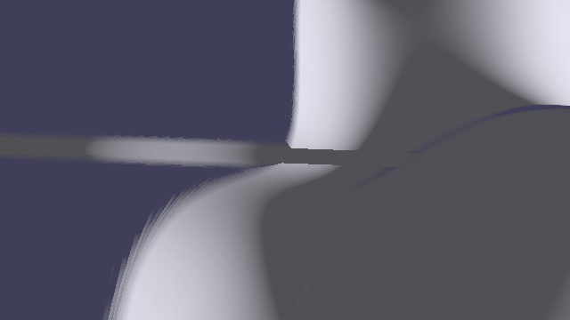
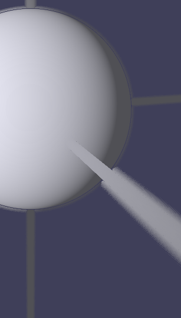
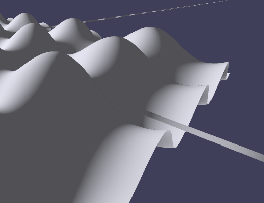
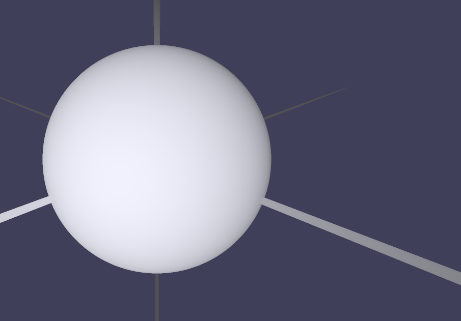

# AntiAliasing

## Distance based Alpha

My first attempt to get rid of the aliasing in the grapher was to change the Sphere trancing a little bit. In the vanilla sphere tracing the ray either hits the surface or not (boolean 1, 0);

In order to get rid of the hard edges that lead to the aliasing issue, I decided to move away from the hard hit or not "boolean" to a float based "hit". meaning that I get a float between 0 and 1 based on how "hard" the ray hits the surface. As the ray travels farther from the camera the ray that one pixel represents gets larger too. The focus here is volumetric and the surface feels smooth. It fakes anti-aliasing but giving the surface a feeling of being like fog, cloud etc. Mathematically we calculate a pixel footprint

```math
\omega = d_o \cdot \frac{2\, tan(FOV/2)}{H}
```

and then we calculate $\alpha$.

```math
\alpha = 1 - clamp((d_s - \theta)/\omega, 0, 1)
```

Also since we now don't have a "hit" or "not hit" the Lambertian doesn't work correctly. My solution led to a problem of depth priority afterwards

<div style="display: flex; gap: 100px; align-items: flex-start;">

  <div>
    
  </div>

</div>

<div style="display: flex; gap: 100px; align-items: flex-start;">

  <div>
    
  </div>

</div>

## Supersampling

I wanted to test something. What if I look at the ground truth and then I can know what is the ULTRA HIGH quality that I can get and I compare everything to that. So I went with supersampling. The result was amazing but the PC was not really having fun. So what I did was that instead of shooting one ray per pixel, we shoot four rays per pixel.

<div style="display: flex; gap: 100px; align-items: flex-start;">

  <div>
    
  </div>

</div>

<div style="display: flex; gap: 100px; align-items: flex-start;">

  <div>
    
  </div>

</div>
