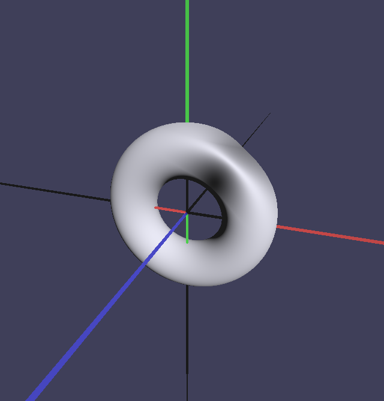
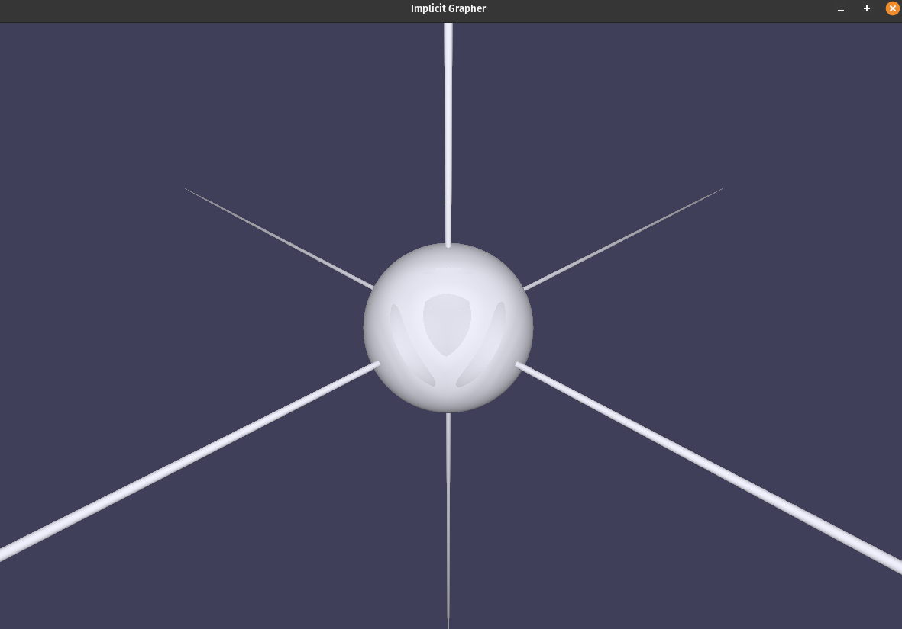
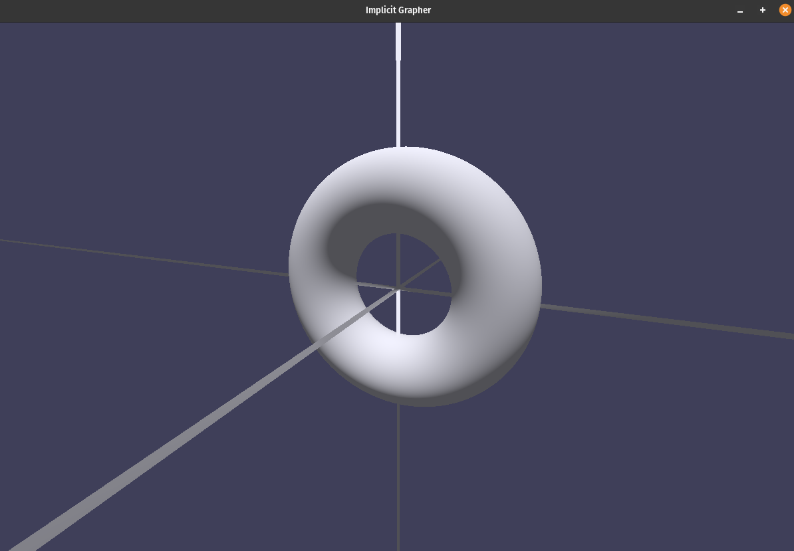
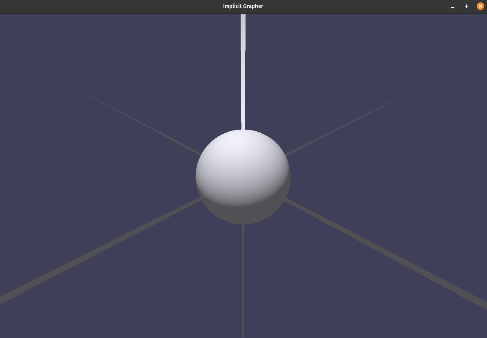

# Raymarching

## In the case of SDE

In raymarching, the scene is a scalar field and we find the root of an implicit function. A ray shoots out from the camera and tries to learn about the world it lives in. The Ray Equation is:

```math
\vec{P}(t) = \vec{O} + t \hat{D}
```

Here:

- $\vec{O}$ is the origin (or the camera position),
- $\hat{D}$ is the normalized direction vector of the ray
- $t$ is the scalar distance $t \in [0, \infty)$.

Here, for our raymarching we use sphere tracing. In every step the ray asks itself if it has hit something or if the path is free. Let's assume the signed distance function is $f(p)$ where $p$ is a point is space. If

- $f(p) > 0$ the ray is outside of the object
- $f(p) < 0$ the ray has overshot and is inside the object
- $f(p) \approx 0$ ray has hit a surface.

Via raymarching we can even combine two implicit functions using contructive solid geometry, meaning that a complex topology can be handled by simple set theory.

## In the case of None SDE

Pretty quick, I saw artifacts when I implemented the code. Examples:

<div style="display: flex; gap: 100px; align-items: flex-start;">

  <div>
    
  </div>

</div>

<div style="display: flex; gap: 100px; align-items: flex-start;">

  <div>
    
  </div>

</div>

These eaten and dark surfaces were due to the fact that the give equation were not SDEs and were not Lipschitz perfect. Meaning that the Lipschitz constant L:

```math
L = || \nabla f(p) ||
```

were bigger than 1. (Lipschitz surface has a Lipschitz constant of 1). Raymarching in its pure form is only safe to be used on Lipschitz perfect surfaces and in other cases it will overshoot and the ray tunnels through the shape. To tackle the problem I used Hart's distance estimator

### Hart's distance estimator

This distance estimator is a first order Taylor approximation.

```math
D(p) = \frac{|f(p)|}{|| \nabla f(p) ||}
```

This distance estimator is much more closer to the actual SDE than a given implicit function. When I used this the eaten shapes where gone

<div style="display: flex; gap: 100px; align-items: flex-start;">

  <div>
    
  </div>

</div>

<div style="display: flex; gap: 100px; align-items: flex-start;">

  <div>
    
  </div>

</div>
